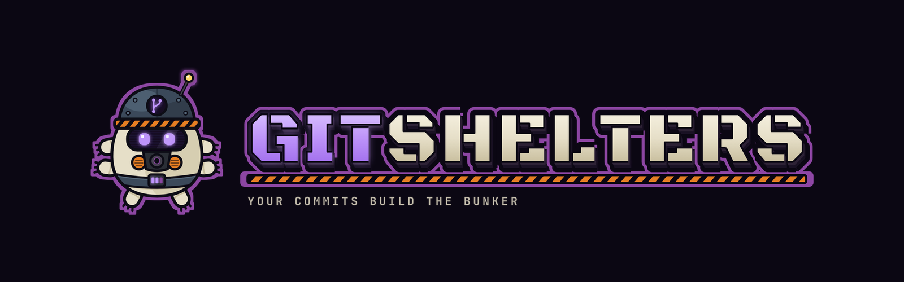
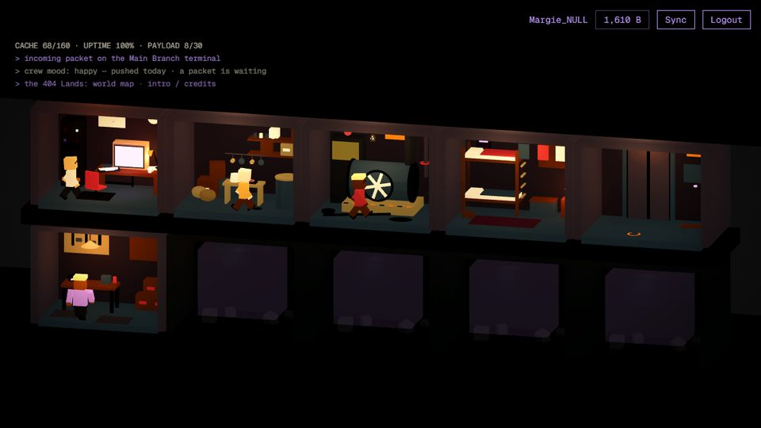
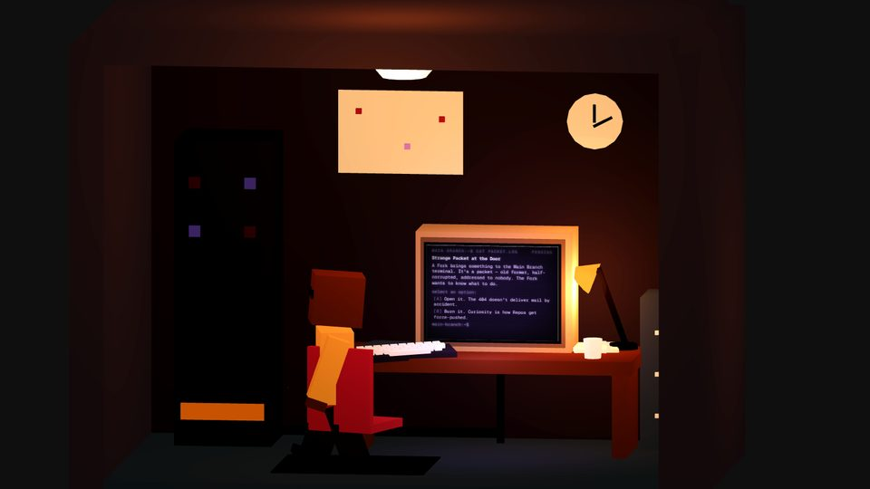
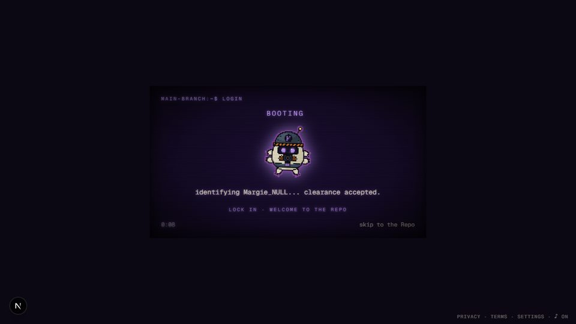

<p align="center">
  
</p>

<p align="center">
  <strong>Your commits build the bunker. Your idle still earns. Your absence is canon.</strong><br />
  An idle base-builder where real GitHub activity feeds a post-apocalyptic bunker.
</p>

<p align="center">
  <a href="https://gitshelters.com">Play the alpha</a> ·
  <a href="https://gitshelters.com/map">The 404 Lands</a> ·
  <a href="./docs/art-guide.md">Art guide</a> ·
  <a href="./CONTRIBUTING.md">Contributing</a> ·
  <a href="./docs/adr/">Decisions</a> ·
  <a href="./devlog/">Devlog</a>
</p>

<p align="center">
  <a href="https://github.com/GuiBarradas/git-shelters/actions/workflows/ci.yml"></a>
  <a href="./LICENSE"></a>
  
</p>

---

## The game

There was the **Great Merge Conflict**: late one Tuesday, every public repository on the planet went into conflict at once. What is left of the internet is the **404 Lands**. The people who made it are **Maintainers**, holed up in their **Repos** with old batteries and a local clone of Wikipedia. You are one of them.

- Every push you make on GitHub, in real life, becomes **Bytes** inside the bunker.
- Bytes build rooms. Rooms give your survivors, the **Forks**, work: a Cook in the Cache Storage, an Engineer on the Power Plant, a Tinkerer at the Workshop bench.
- **Cache** (food) and **Uptime** (power) are simulated while you are away. No engineer, and the lights go out.
- A **Daily Event** arrives on the Main Branch terminal every day. You decide; the crew reacts.
- The Forks feel your commit log. Push today and they are happy. A week of silence and they get bitter, and they say so when you poke them.
- Badges land on your public profile. Every bunker is a dot on the map of the 404 Lands.

<p align="center">
  
</p>

<p align="center">
  
  
</p>

## How it is built

Everything you see is procedural: three.js primitives, a toon shader, a fixed palette, and no external 3D model. The world is a cross-section of the bunker rendered with an orthographic camera; each room is a set of boxes, cylinders and lights, and each Fork is a handful of voxels driven by a tiny behaviour loop. The read-outs inside the rooms are plain HTML pinned to the scene.

The game is deliberately server-authoritative and boring where it counts:

- **Bytes are a ledger.** Every credit and debit is a row with a unique `(user, source, ref)` key, so a push is paid once no matter how many syncs race. Balances are materialised, never recomputed.
- **The economy is a pure function.** `simulate(state, workforce, hours)` runs once when you show up and is written back with an optimistic guard. One tick of three hours equals three ticks of one hour, and the test says so.
- **Everything derived stays derived.** Mood comes from the last push, badges from state the game already has, a bunker's spot on the map from a hash of the login. Nothing is stored that can be computed.
- **Postgres decides.** Costs, caps, the bed count and the elevator gate live in SQL functions with row locks; the TypeScript catalog mirrors them for the UI.
- **Public by construction.** A profile shows exactly the fields one mapper copies out, and a CI test feeds that mapper every sensitive field we could think of and asserts none survive.

| Layer | Tech |
|---|---|
| Runtime | Next.js 16 App Router · React 19 · TypeScript 5 (strict, `noUncheckedIndexedAccess`) |
| 3D | three.js via `@react-three/fiber` and `@react-three/drei` |
| UI | Tailwind v4 · one mono font · a CRT in CSS |
| Backend | Supabase (Postgres, RLS, Auth) · Server Actions · a GitHub Actions cron |
| Audio | Two `<audio>` elements and a preference in localStorage |
| Tests | Vitest (unit and integration against a throwaway user) · Playwright |
| Quality | ESLint with the React Compiler rules · Husky · lint-staged · Sentry |

Runs on free tiers. Sixty frames per second on an Intel Iris Xe.

## Running it

You need Node 22+, pnpm 10+ and a Supabase project (the free tier is enough).

```bash
git clone https://github.com/GuiBarradas/git-shelters.git
cd git-shelters
pnpm install
cp .env.local.example .env.local   # then fill it in
pnpm db:push                 # applies supabase/migrations to your project
pnpm db:types                # regenerates src/lib/supabase/database.types.ts
pnpm dev
```

| Variable | What for |
|---|---|
| `NEXT_PUBLIC_SUPABASE_URL`, `NEXT_PUBLIC_SUPABASE_ANON_KEY` | the browser client |
| `SUPABASE_SERVICE_ROLE_KEY` | server-only writes (ledger, sync, badges) |
| `GITHUB_TOKEN` | a read-only token so the sync is not rate-limited |
| `CRON_SECRET` | shared secret for `/api/cron/sync` |
| `SENTRY_*` | optional; errors go nowhere without them |

GitHub OAuth is configured in the Supabase dashboard (Authentication → Providers → GitHub) with your app's callback URL.

| Script | What it does |
|---|---|
| `pnpm dev` | dev server |
| `pnpm test` | unit tests, no network |
| `pnpm test:integration` | against your Supabase project, with throwaway users |
| `pnpm test:e2e` | Playwright |
| `pnpm lint` · `pnpm typecheck` | what the pre-commit hook runs |
| `pnpm db:new <name>` | a new migration file |

## Where things live

```
src/app/            routes, Server Actions, the cron and API handlers
src/components/     scene/ (the bunker, rooms, Forks), hud/, intro/, audio/, map/
src/lib/            economy/ (tick, away report), forks/ (catalog, mood, jobs),
                    badges/, regions/, github/ (sync), anti-cheese/, api/ (public reads)
supabase/migrations one file per change; SQL functions are the authority
docs/adr/           why things are the way they are
DESIGN.md           the public summary of the design
docs/art-guide.md   how to draw a room that belongs in this bunker
devlog/             the story of the design, in the open
```

## Contributing

Issues and pull requests are welcome, from a typo in a Fork's line to a whole room. Start with [CONTRIBUTING.md](./CONTRIBUTING.md): it explains the setup, the conventions, and how to add a room, a badge or a dialogue line without touching anything else. The [art guide](./docs/art-guide.md) (also as a [PDF](./docs/art-guide.pdf)) is the contract for anything visual.

## Credits

Design, code, words and 3D by [Guilherme Martins Barradas](https://github.com/GuiBarradas). Brand art by the author. Music: "Uncontained" by Alana Jordan; ambience "The Shining Ambience" by Mezhdunami and "The Foyer Mirror" by turning_pages, all under the Pixabay Content License.

## License

Code: [AGPL-3.0-only](./LICENSE). Run it, fork it, improve it; if you host a modified copy as a service, publish your source under the same terms.

Content: the name Git Shelters, the setting, the names of places, survivors, traits and rooms, the Daily Event texts, the brand and the visual identity are not covered by the AGPL and remain with the author. Ask before reusing them. See [ADR 0009](./docs/adr/0009-license-agpl-code-reserved-content.md).
