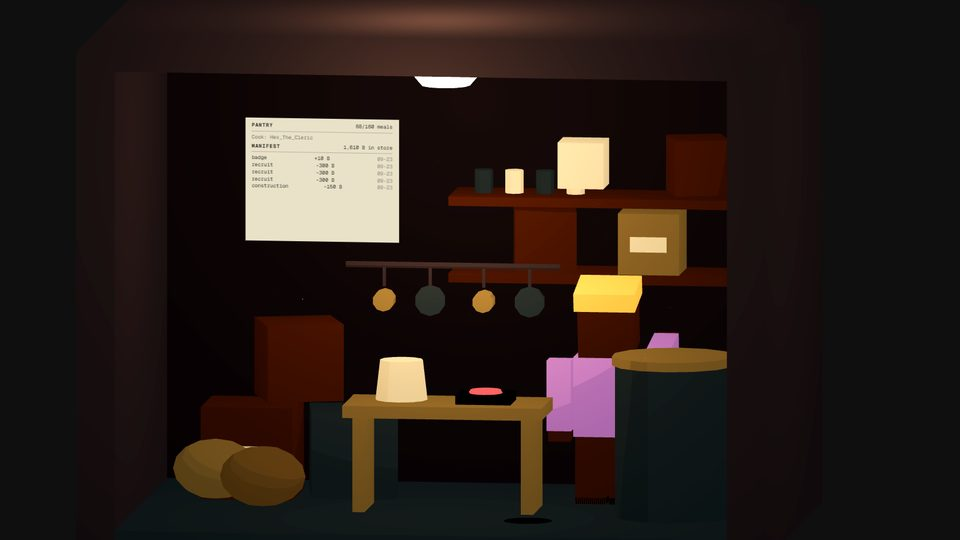
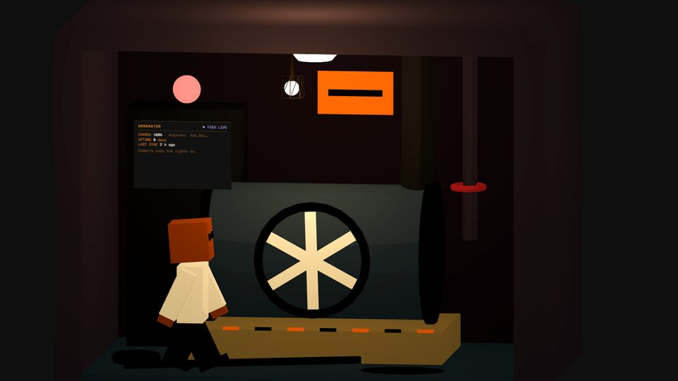
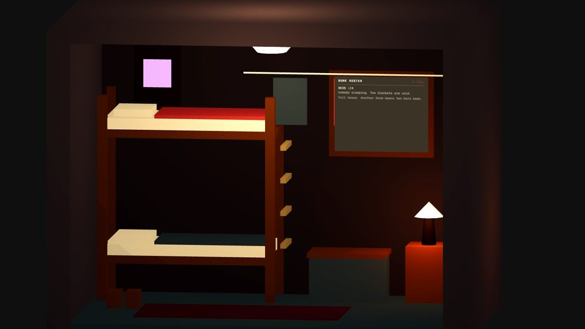
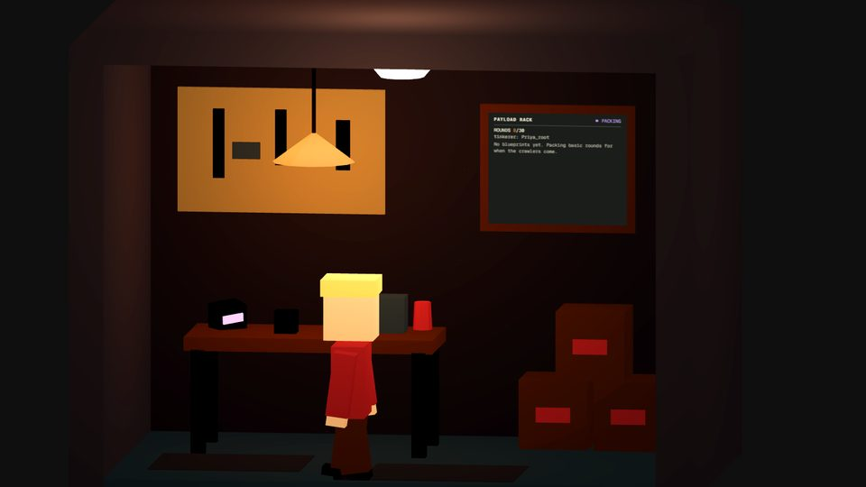
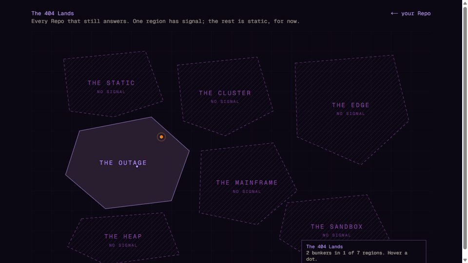

# Git Shelters art guide

The contract for anything visual in the game: the world, the rooms, the Forks, the interface and the brand. If a picture is not covered here, ask before drawing it. Also available as a [PDF](./art-guide.pdf).

## 1. Pillars

1. **A dollhouse cut open.** The bunker is a cross-section: rooms side by side, open at the front, seen from slightly above and to the right by an orthographic camera. Depth exists but the reading is frontal. Nothing important hides behind anything.
2. **Primitives and toon.** Every mesh is a three.js primitive (box, cylinder, cone, sphere, torus, plane) with `meshToonMaterial`. No imported models, no textures. Detail comes from more, smaller primitives, not from surface.
3. **Warm inside, violet where it glows.** Rooms are lit by warm lamps. Violet belongs to screens, LEDs, indicators and the interface. A violet lamp is a mistake.
4. **Lived in, not pretty.** Clutter tells the story: a mug, a cable bundle, boots by the bunk, a stopped clock. Everything looks scavenged, repaired, labelled by hand.
5. **Dry humour, no gore.** The apocalypse is a merge conflict. Danger is a blinking beacon and a hazard stripe, never blood.

## 2. Palette

The tokens live in `src/lib/palette.ts` and `src/app/globals.css`. Use them by name; do not invent hex values in components unless it is a one-off shade of an existing token.

| Token | Hex | Use |
|---|---|---|
| `bunkerBlack` | `#0B0713` | page and panel background, the earth |
| `inactivePlum` | `#2D2235` | unbuilt cells, inactive blocks, map regions |
| `phosphorViolet` | `#BD93F9` | interface text, borders, screens, LEDs, emissives |
| `violetDim` | `#8D46A3` | dim borders, glows, locked things |
| `amber` | `#E67E22` | calls to action, warnings, the active Main Branch lamp, the Maintainer's own dot |
| `lampWarm` | `#FFC98A` | every room lamp |
| `concrete` | `#45414F` | beams, pillars, shell |
| `concreteTan` | `#8B7E5A` | furniture, cabinets, small props |
| `oldWoodBrown` | `#5C3A21` | desks, bunks, crates |
| `steelBlue` | `#3A4A5A` | floors, drums, steel |
| `boneWhite` | `#E6DFC8` | body text, paper, mattresses, mugs |
| `fadedRed` | `#A14545` | danger, the chair, blankets |
| `mustardWarning` | `#D4A24C` | sparingly: a crate, a shirt |
| `glowYellow` | `#FFD66B` | the idle Main Branch lamp, a helmet |
| `coalBlack` | `#0F0F0F` | black objects |

Rules: no green anywhere. Amber is the only warm accent in the interface. Text on the background is `boneWhite` for prose and `phosphorViolet` for anything the game says.

## 3. Light

- The room shell gives every cell one hanging lamp, `lampWarm`, intensity around 4 to 6, plus a faint neutral ambient from the corridor. That is the base; do not fight it.
- A room may add one or two small point lights of its own where a prop emits light: a desk lamp, a caged bulb, a nightstand. Amber, distance 2 to 3, decay 2.
- Screens, LEDs and indicators glow through `emissive`, not through lights, except the Main Branch screen which also tints the desk with a small violet point light.
- A dark bunker is a feature. When `powered` is false, lamps drop to about 12% and emissives go to zero. Every room takes a `powered` prop and must read as dead without it.
- The green terminal is gone. Screens are violet phosphor on `#150a26`.

## 4. Space and scale

A cell is 4 wide, 3 high, 3 deep, centred at the origin; the floor is y = 0, the back wall's face is at **z = -1.25** (the shell's wall is 0.25 thick from z = -1.5). Anything on the wall sits at z ≥ -1.22 or it is inside the wall and invisible. Pillars stand at x = ±2.1; keep props inside x = ±1.85.

A Fork is about 1.45 tall. Waist height is 0.66 (desks), seat height 0.3 to 0.5, shelves from 1.4 up. A survivor's head must clear a bunk, a lamp shade and the bottom of any HTML read-out.

## 5. A room's anatomy

Every interior exports three things and registers them in `src/components/scene/rooms/index.tsx`:

- **`LAYOUT`**: a walk lane (`{ z, xMin, xMax }`, usually z ≈ 1.1, the front strip) and a list of stations. The lane is furniture-free by contract; a Fork enters a station straight from the lane along z and leaves the same way. A station has a position (feet), a facing, an action (`sit`, `type`, `work`, `inspect`), a hold time, and for sitting a `seatY`.
- **A panel anchor**: where the room's HTML read-out is pinned (position, width, height). One world unit is 40 CSS pixels. The read-out is DOM over the canvas: it paints over everything, so keep stations out of its screen area or a Fork will vanish behind text.
- **The interior component**: `<RoomShell light lightIntensity powered>` and children. Read `MainBranchRoom.tsx` first; it is the reference for density.

Density target: one hero object (the terminal, the drum, the bunk, the bench, the shaft), two or three secondary objects, and five to ten pieces of clutter. Group related primitives so they move together.

  
  

  
  

## 6. The Forks

A Fork is voxels of 0.2: head, torso, two arms, two legs with knees, hips at 2.2 voxels. Skin, shirt, trousers and an optional helmet come from the Fork's seed through `forkLook()`; shirts draw from the palette. Mood changes motion, not shape: speed, head pitch and bounce in `MOOD_MOTION`. When sitting, the model's origin drops so the hips land on `seatY`; check the pose in a screenshot, never by reasoning alone.

Do not add faces beyond the two eyes, and do not add animations that are not driven by the behaviour loop.

## 7. Interface

- One monospaced font everywhere. Uppercase with wide tracking for labels, sentence case for lines the game says, `>` as the prompt prefix.
- Panels are `bunkerBlack` at 90 to 95% with a one-pixel `phosphorViolet` border at 40 to 60%. No rounded corners, no shadows except the CRT's inner shadow.
- The CRT (`.crt`) is for terminals only: the Main Branch screen and the intro. Scanlines, vignette, a slow flicker. Do not put it on ordinary panels.
- Notices that fade (`.hud-fade`) are for one-shot facts: a build result, a badge, a sync outcome. Persistent state goes in the HUD lines at top left.
- Amber marks the thing you can do. Red marks the thing that went wrong. Violet is everything else.

## 8. Brand

The lockup (mascot plus wordmark), the wordmark and the mascot live in `public/brand/` as transparent PNGs, with the sources in `assets/`. Use the lockup on dark backgrounds only, never smaller than 320 pixels wide, with clear space equal to the mascot's height around it. The mascot on its own may be used as an icon; the pixel version (`mascot-pixel.png`, 56 pixels, rendered with `image-rendering: pixelated`) is for terminal moments like the intro.

The brand is not under the code license. Do not restyle it, recolour it or put it next to other logos as if it endorsed them.

## 9. The world

The 404 Lands are seven regions. Only The Outage is open in the alpha; the others are drawn locked, hatched, "no signal". When a region opens it gets a theme: wall tone, lamp colour, one or two signature props, and a hatch pattern on the map. The intended vibes, from the design document:

| Region | Vibe | Signature |
|---|---|---|
| The Outage | total blackout, emergency lighting | black walls, red beacons, sirens |
| The Static | white noise, ghost broadcasts | distorted CRTs, lo-fi melancholy |
| The Heap | memory never collected | piles of old hardware, nostalgia |
| The Cluster | feral data centers | server racks, cold blue, corporate decay |
| The Mainframe | ruins of the megaservers | beige terminals, magnetic tape, IBM seventies |
| The Sandbox | nothing behaves twice | walls that shift colour, controlled glitch |
| The Edge | where the maps stop | clean sci-fi minimalism, frontier |

## 10. Do and do not

**Do**: reuse a palette token; add clutter; light with a warm lamp; test a pose with a screenshot; keep stations off the read-out; name a prop for what it is in the world.

**Do not**: import a model or a texture; use green; light a room violet; put a prop inside the wall; add a postprocessing pass; reference any other game's assets, names or trade dress; add a face, a logo or a text mesh.

## 11. Checklist for a visual PR

- [ ] Palette tokens only.
- [ ] Wall props at z ≥ -1.22; nothing beyond x = ±1.85.
- [ ] Reads at corridor scale and at room scale (two screenshots attached).
- [ ] Reads with `powered` false.
- [ ] A Fork walked through it for a minute without crossing furniture.
- [ ] The HTML read-out does not cover a station.
- [ ] Sixty frames per second on an integrated GPU (headed Chrome, not headless).
